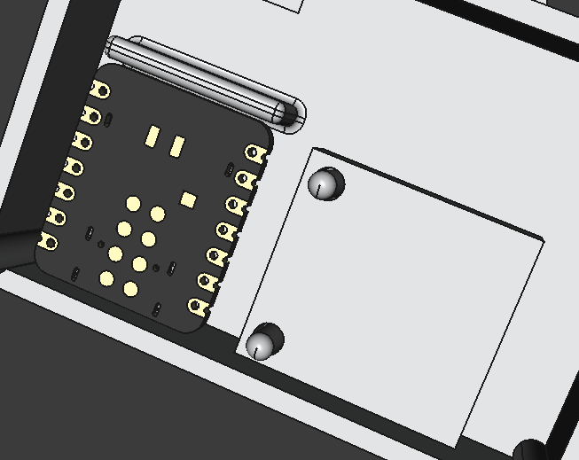
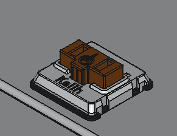
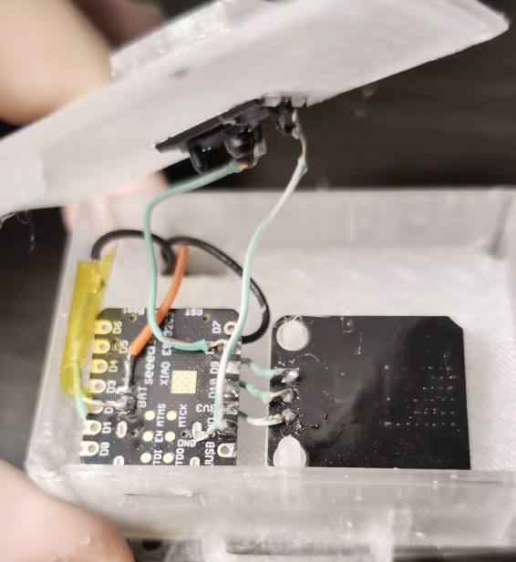
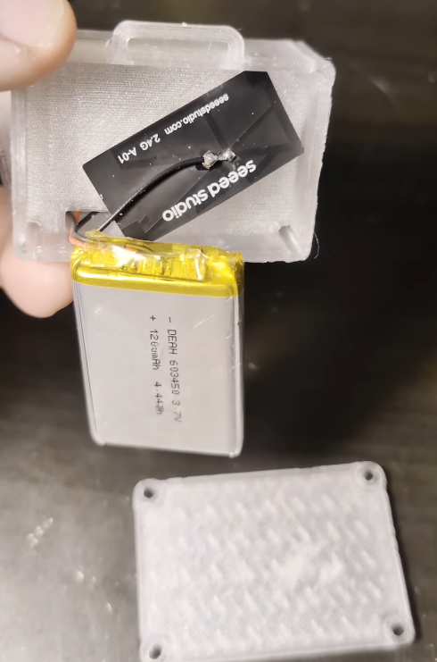
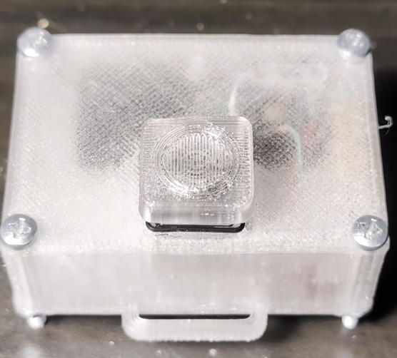
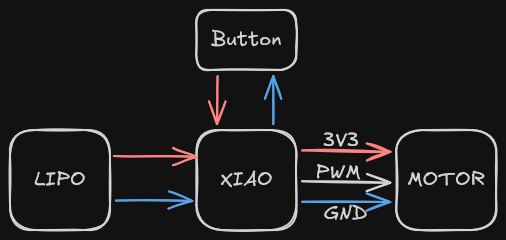

# Instructions

## Parts

- xiao esp32-c3
- deah603450 lipo battery
- choc keyboard switch
- vibration motor module
- 4 screws
- 4 nuts
- a watchband

## Assembly

1. Put all of the parts in their place 
    
    
    

    
    

2. Solder up everything based on the diagram

3. Screw the screws in

    

## Diagram

